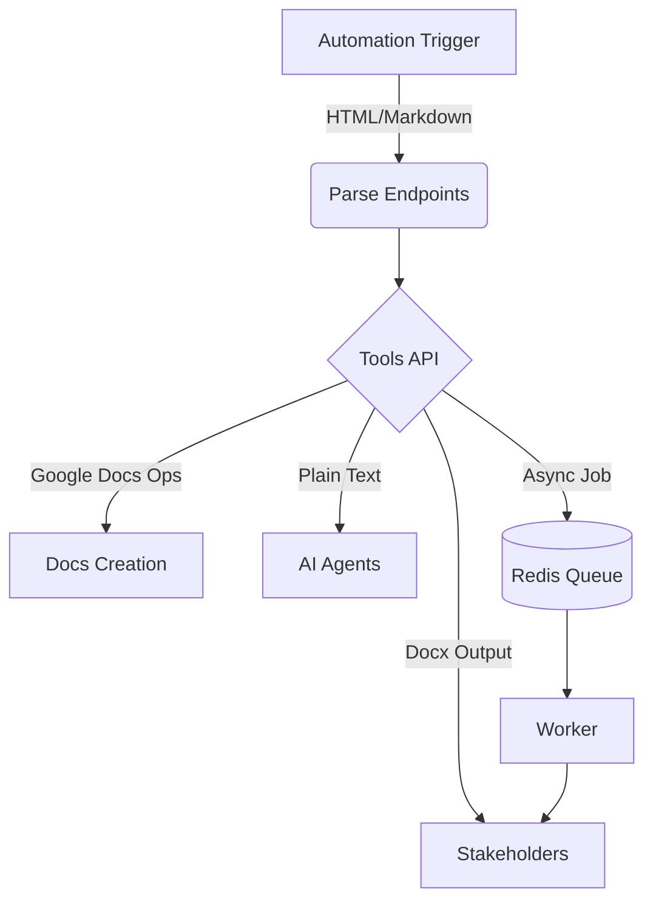

# Tools API

**Automate document-heavy workflows without building bespoke microservices.** Tools API is the FastAPI-powered backbone for automation teams and operations engineers who need reliable parsing, conversion, and document generation capabilities for AI agents and human-in-the-loop processes.

---

## Why Tools API?
- **Ship new automations faster.** Drop in ready-made endpoints for HTML, Markdown, and Docx so your n8n or Zapier flows can launch in hours, not sprints.
- **Guarantee formatting fidelity.** Preserve fonts, colors, lists, tables, and more when converting between rich text formats and Google Docs.
- **Scale with confidence.** Async endpoints, modular architecture, and Docker-ready deployment keep workflows resilient across teams and environments.

> *"Tools API saved us weeks of internal API development. We connected it to our agent workflows in a day and never looked back."* — Lead Automation Engineer, Series B SaaS company

---

## Pain Points We Solve
| For Automation Leads | For Operations Engineers | For Platform Owners |
| --- | --- | --- |
| Keeping agents aligned with brand formatting | Maintaining brittle in-house parsing scripts | Delivering new document tooling without slowing core roadmap |
| Handling countless conversion edge cases | Supporting varied file types and legacy systems | Providing governance and observability across teams |
| Orchestrating async workloads reliably | Debugging asynchronous queue workers | Balancing cost, reliability, and security expectations |

---

## Feature Showcase
- **Rich Text Conversion Engine** – Translate HTML or Markdown into Google Docs operations with full styling fidelity ([rich_text_guide](./rich_text_guide.md)).
- **Docx Toolkit** – Parse uploaded `.docx` files into plain text or generate `.docx` documents from JSON payloads.
- **Queue-Ready Workflows** – Built-in Redis + RQ worker enables durable background processing for large document jobs.
- **Modular Architecture** – Add new tool routers quickly; see [code_flow.md](./code_flow.md) for an overview.
- **JavaScript Tool Bridge** – Wrap Node.js utilities (like the panorama splitter and Cobalt media downloader) in Python-friendly REST endpoints with binary-friendly delivery for n8n.
- **Media Toolkit** – Use the bundled yt-dlp endpoint to inspect streams or fetch downloadable media with automation-ready headers.
- **Observability Hooks** – Centralized logging and error handling give SRE and platform teams the visibility they expect.



---

## Proof in Practice
- **OpsHub (Case Study)** – Replaced fragile custom scripts with Tools API, cutting document prep time by 65% and freeing two engineers per quarter.
- **Global Support Org (Testimonial)** – *"Our agents format escalation reports flawlessly now. Tools API handles every edge case we throw at it."*

---

## Quick Start CTA
1. **Spin it up locally** – `uvicorn app.main:app --reload`
2. **Hit the live docs** – Visit `http://localhost:8000/docs` to try endpoints instantly.
3. **Plug into your automation** – Connect to n8n or your agent framework via simple HTTP requests.

👉 **Ready for a deeper dive?** [Book a 15-minute walkthrough](mailto:hello@toolsapi.io?subject=Tools%20API%20Walkthrough) or share it with your automation lead.

---

## Live Demos & Resources
- **Interactive API Docs:** `http://localhost:8000/docs`
- **Rich Text Examples:** See the [rich text guide](./rich_text_guide.md)
- **Cobalt Integration Guide:** Configure a Cobalt instance for media downloads via `/js-tools/cobalt` (see below).
- **Queue Worker Walkthrough:** Explore `worker.py` for background job orchestration.

---

## Engineer's Appendix
### Install
```bash
pip install -r requirements.txt
```

### Run Locally
```bash
uvicorn app.main:app --reload
```

### JavaScript-powered tools
Some endpoints rely on Node.js tooling. Install Node 18+ and npm so the API can install dependencies on first run:

```bash
# Example: ensure dependencies for the bundled panorama splitter are installed
cd tools-api/js_tools/panosplitter
npm install
```

When the API boots it will run `npm install` for you if `node_modules/` is missing.

#### Binary responses & n8n compatibility
- **Panosplitter:** add `response_format=binary` to receive a ready-to-share `.zip` archive. The archive now includes a `manifest.json` file for metadata, and the API echoes a `X-Panosplitter-Manifest` header (base64 JSON) that n8n can decode without parsing the body.
- **Cobalt downloads:** set `response_format=binary` on `/js-tools/cobalt` to stream media directly for n8n's binary items. The response contains a `Content-Disposition` header plus `X-Cobalt-Metadata` with the originating JSON payload.

#### Cobalt media downloader
Expose an existing [Cobalt](https://github.com/imputnet/cobalt) deployment through Tools API:

```bash
export COBALT_API_BASE_URL="https://your-cobalt-instance.example"
# Optional authentication if your instance requires it
export COBALT_API_AUTH_SCHEME="Api-Key"
export COBALT_API_AUTH_TOKEN="your-token"
# Optional timeout override (seconds)
export COBALT_API_TIMEOUT="90"
```

Once configured you can `POST /js-tools/cobalt` with any options supported by Cobalt's schema (for example `audioFormat`, `videoQuality`, or service-specific flags). Default responses return the raw JSON from Cobalt. Include `{"response_format": "binary"}` to download the media bytes directly via Tools API.

#### yt-dlp media helper
Tools API now ships with a thin wrapper around [yt-dlp](https://github.com/yt-dlp/yt-dlp) for quick metadata lookups or direct downloads:

```bash
curl -X POST http://localhost:8000/media/yt-dlp \
  -H "Content-Type: application/json" \
  -d '{
        "url": "https://www.youtube.com/watch?v=dQw4w9WgXcQ",
        "options": {"format": "bestvideo+bestaudio/best"}
      }'
```

- Default responses return the full yt-dlp metadata, perfect for agent reasoning or UI previews.
- Set `"response_format": "binary"` to receive the media stream directly. The response includes `Content-Disposition` and `X-YtDlp-Metadata` headers to keep n8n or Zapier automations informed about the download.
- Pass optional headers (cookies, auth) or proxy settings via the `options` object to handle restricted content.

### Docker
```bash
docker-compose up --build
```

### Background Worker
```bash
# Start Redis (example using Docker)
docker run -d --name redis -p 6379:6379 redis:7

# Start the worker
python worker.py
```

### Tests
```bash
pytest
```

Need to extend Tools API? Follow the patterns documented in [code_flow.md](./code_flow.md) and submit improvements via pull request.
